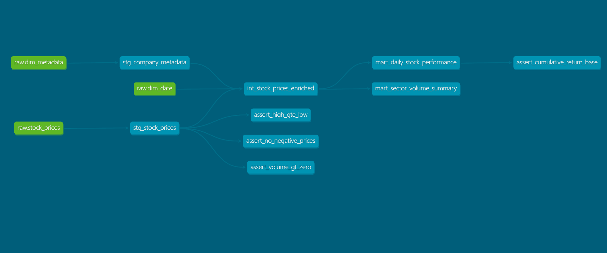

[](https://github.com/gamegtboyz/finance_data_platform/actions/workflows/ci.yml)
[](https://github.com/gamegtboyz/finance_data_platform/actions/workflows/ci.yml)

# Financial Data Platform Project
A production-style financial data platform built with Python, PostgreSQL, AWS (S3 + Redshift), Apache Airflow, and dbt. Demonstrates end-to-end data engineering practices across three stages: local batch ETL, cloud-native pipeline on AWS, and a fully orchestrated modern data stack with scheduled DAGs, version-controlled SQL transformations, data quality tests, and a CI/CD pipeline.

## Architecture

```
AlphaVantage API
      ↓
Airflow DAG (scheduled daily, Mon–Fri 23:00)
      ↓
  extract_task  →  fetch OHLCV + metadata → dual-write local + S3
      ↓
  transform_task  →  type casting, calendar attributes, metadata validation
      ↓
  load_task  →  Redshift COPY from S3 (via IAM role) → DELETE+INSERT → VACUUM+ANALYZE
      ↓
Redshift Serverless Data Warehouse
  ├── dim_date      (DISTSTYLE ALL, SORTKEY date)
  ├── dim_metadata  (DISTSTYLE ALL)
  └── stock_prices  (DISTKEY symbol, SORTKEY date)
      ↓
dbt Transformation Layer
  ├── staging/    stg_stock_prices, stg_company_metadata          (views)
  ├── intermediate/  int_stock_prices_enriched                    (table)
  └── marts/      mart_daily_stock_performance (incremental)
                  mart_sector_volume_summary   (table)
```

### dbt Lineage



## Tech Stack
| Layer | Tool |
|---|---|
| Language | Python 3.9+ |
| Orchestration | Apache Airflow 2.9 (Docker Compose) |
| Transformation | dbt-redshift 1.10 |
| SQL Linting | sqlfluff |
| Local Database | PostgreSQL 15 |
| Cloud Database | Amazon Redshift Serverless |
| Cloud Storage | AWS S3 |
| AWS SDK | boto3 |
| DB driver (PostgreSQL) | psycopg2-binary |
| DB driver (Redshift) | redshift-connector |
| DB Toolkit | SQLAlchemy |
| Data processing | pandas, numpy |
| HTTP | requests |
| Config | python-dotenv |
| Containerisation | Docker / Docker Compose |
| Testing | pytest, moto |
| CI/CD | GitHub Actions |

## Prerequisites
- Python 3.9 or later
- Docker Desktop (for local PostgreSQL mode and Airflow)
- AlphaVantageAPI (free API key here: https://www.alphavantage.co/support/#api-key)
- AWS account with S3 and Redshift Serverless provisioned (for cloud mode -- see AWS Setup below)
- dbt-redshift (`pip install dbt-redshift`)

## AWS Setup
Follow these steps once before running in Redshift mode.  
**1. S3**  
- Create bucket `finance-data-platform-raw`; enable data versioning
- Prefix conventions: `./{symbol}/{symbol}_YYYY-MM-DD.json` and `./{symbol}/{symbol}_metadata.json`

**2. IAM -- Pipeline user (local → S3)**
- Create policy `FinancePipelineS3Policy` with `s3:GetObject`, `s3:PutObject`, `s3:Listbicket` scoped to our target bucket only.
- Create IAM user `finance-pipeline-local`; attach only the created policy
- Generate access keys; store in `.env` -- never commit via `./.gitignore`

**3. IAM -- Redshift Role (Redshift → S3)**  
- Create role `RedshiftS3ReadRole` with Redshift service trust policy + read-only access to the raw bucket
- Attach the role to your Redshift Serverless namespace

**4. Redshift Serverless**
- Provision a Serverless workgroup (8 RPUs recommended); set auto-pause to 15 minutes idle time.
- Open the workgroup's security group inbound rule: port 5439 from your local IP address
- Confirm the public endpoint is enabled

**5. Cost controls**
- Create an AWS Budgets alerts (estimated by $5 per month solely from this project)


## Local Setup
**1. Clone the repository**
```bash
gh repo clone gamegtboyz/finance_data_platform
cd finance_data_platform
```
**2. Create virtual environment**
```bash
# create virtual environment
python -m venv venv

# activate environment
## on macOS / Linux:
source venv/bin/activate

## on Windows Command Prompt
venv\Scripts\activate.bat

## on Windows PowerShell
Set-ExecutionPolicy -Scope CurrentUser -ExecutionPolicy Unrestricted -Force
.\venv\Scripts\Activate.ps1
```

**3. Install Dependencies**
```bash
pip install -r requirements.txt
```

**4. Configure Environment**
```bash
# This is just example, use your own settings accordingly
cp .env.example .env
```

5. Start PostgreSQL container:
```bash
docker-compose up -d
```

6. Run the pipeline
```bash
# Run full ETL pipeline (fetch → S3 → Redshift)
python -m src.pipeline

# Reprocess from local/S3 files without calling the API
python -m src.reprocess_pipeline
```

With this execution, `pipeline.py` will:
1. Fetch OHLCV data and company metadata from AlphaVantage API for NVDA, AAPL, MSFT, GOOGL, and AMZN into .json files
2. Dual-write JSON files locally and upload to S3 under `./{symbol}` prefix
3. Transform into tabular format with calendar attributes
4. Create the schema tables -- skipped if already present
5. Load dimension tables, then incremental factual data into fact table
6. In Redshift mode: stage via S3 `COPY` → `DELETE+INSERT` → `VACUUM+ANALYZE`

## Airflow Setup

The Airflow DAG schedules the full pipeline on weekdays at 23:00 UTC (2 hours after US market close).

**1. Start Airflow**
```bash
cd airflow
docker compose up -d
# UI available at http://localhost:8080  (user: airflow / pass: airflow)
```

**2. Configure Connections in the Airflow UI**

Go to **Admin → Connections** and add:

| Conn Id | Conn Type | Details |
|---|---|---|
| `aws_default` | Amazon Web Services | Access Key + Secret Key from your IAM user |
| `redshift_default` | Amazon Redshift | Host, port 5439, schema, login, password |

**3. Trigger the DAG**

In the Airflow UI, enable `stock_pipeline_dag` and click **Trigger DAG**. Watch all three tasks (`extract → transform → load`) go green.

**DAG features:**
- Retries: 3 attempts with 10-minute delay on each task
- SLA: 1h on extract, 1.5h on transform, 2h on load — fires `sla_miss_callback` on breach
- `on_failure_callback` logs task failure details (hook to Slack/email for production)

## dbt Setup

dbt models transform raw Redshift tables into analytics-ready marts.

**1. Configure `profiles.yml`** (at repo root, already committed — reads from env vars):
```bash
# Ensure these are set in your .env
REDSHIFT_HOST=...
REDSHIFT_PORT=5439
REDSHIFT_NAME=finance_db
REDSHIFT_USER=...
REDSHIFT_PASSWORD=...
```

**2. Run dbt**
```bash
cd finance_dbt

# Validate all SQL without connecting to Redshift
dbt parse --profiles-dir ..

# Build all models in Redshift
dbt run --profiles-dir ..

# Run all data quality tests
dbt test --profiles-dir ..

# Generate and serve the lineage docs
dbt docs generate --profiles-dir ..
dbt docs serve --profiles-dir ..
```

**dbt model layers:**

| Layer | Models | Materialisation |
|---|---|---|
| Staging | `stg_stock_prices`, `stg_company_metadata` | View |
| Intermediate | `int_stock_prices_enriched` | Table |
| Marts | `mart_daily_stock_performance` | Incremental |
| Marts | `mart_sector_volume_summary` | Table |

**Data quality tests:** `not_null`, `unique`, `relationships`, `accepted_values` on all models, plus 4 singular tests (`assert_no_negative_prices`, `assert_volume_gt_zero`, `assert_high_gte_low`, `assert_cumulative_return_base`).

## Running Tests
```bash
# Unit tests only (no live DB or AWS needed)
pytest tests/ -m "not integration" --ignore=tests/test_dag_integrity.py -v

# Integration tests — requires Docker PostgreSQL running
pytest tests/ -v -m integration

# S3 unit tests — moto mocks, no real AWS needed
pytest tests/test_s3_client.py -v

# Airflow DAG integrity — validates DAG loads without import errors
pytest tests/test_dag_integrity.py -v
```

## Stop all AWS spendings
In case you need to pause the spendings made to AWS you could use the following bash command
```bash
# Pause Redshift Serverless from the AWS console (auto-pause handles this automatically)
# To fully remove all resources:
aws s3 rm s3://finance-data-platform-raw --recursive
aws s3api delete-bucket --bucket finance-data-platform-raw

# Also Delete Redshift Serverless workgroup and namespace from the AWS console
# 1. Delete the workgroup (replace name if yours differs)
aws redshift-serverless delete-workgroup \
  --workgroup-name default-workgroup \
  --region us-east-1

# 2. Wait for deletion to complete, then delete the namespace
aws redshift-serverless delete-namespace \
  --namespace-name default-namespace \
  --region us-east-1
```

## Project Structure
```
finance_data_platform/
├── .github/
│   └── workflows/
│       └── ci.yml                  # CI: pytest, dbt parse, dbt test staging, sqlfluff, DAG integrity
│
├── airflow/
│   ├── docker-compose.yaml         # Official Airflow Docker Compose stack
│   ├── dags/
│   │   └── stock_pipeline_dag.py   # Scheduled DAG: extract >> transform >> load (Mon–Fri 23:00)
│   ├── config/
│   ├── logs/
│   └── plugins/
│
├── finance_dbt/
│   ├── dbt_project.yml             # dbt project config
│   ├── profiles.yml (root)         # Connection profiles — reads from env vars
│   ├── .sqlfluff                   # sqlfluff config: jinja templater, redshift dialect
│   ├── dbt_lineage.png             # Lineage DAG screenshot
│   ├── models/
│   │   ├── staging/                # stg_stock_prices, stg_company_metadata (views)
│   │   ├── intermediate/           # int_stock_prices_enriched (table)
│   │   └── marts/                  # mart_daily_stock_performance (incremental), mart_sector_volume_summary (table)
│   ├── tests/                      # Singular tests: assert_no_negative_prices, assert_volume_gt_zero, etc.
│   ├── macros/
│   └── sqlfluff_macros/            # sqlfluff Jinja mock macros (outside dbt macro path)
│
├── docker-compose.yml              # PostgreSQL container for local mode
├── requirements.txt                # Python dependencies
├── profiles.yml                    # dbt connection profiles (committed — no secrets, uses env_var())
├── .env.example                    # Environment variable template
│
├── sql/
│   ├── sma.sql                     # SMA5 and SMA20 window functions
│   ├── daily_returns.sql           # Daily return calculation
│   ├── volatility.sql              # 21-day rolling volatility (stddev of returns)
│   └── cumulative_return.sql       # Cumulative return from earliest date
│
├── data/
│   ├── raw/{symbol}/               # Raw JSON responses from AlphaVantage
│   └── analytics/                  # CSV output of SQL analytics queries
│
├── src/
│   ├── db_connect.py               # Connection factory — postgres or redshift via DB_ENGINE env flag
│   ├── pipeline.py                 # Main ETL orchestration (fetch → S3 → transform → load)
│   ├── reprocess_pipeline.py       # Reprocess from local/S3 files without API calls
│   ├── analytics.py                # Execute SQL analytics queries; export to CSV
│   │
│   ├── extract/
│   │   └── alphavantage_ingest.py  # API fetch with rate-limit retry, quota detection, dual-write to S3
│   │
│   ├── storage/
│   │   └── s3_client.py            # boto3 wrapper: upload_file, list_objects, download_file
│   │
│   ├── transform/
│   │   └── transform_stock.py      # OHLCV + calendar attribute derivation; metadata parsing
│   │
│   ├── load/
│   │   ├── dimension_loader.py     # dim_date and dim_metadata — Postgres ON CONFLICT / Redshift DELETE+INSERT
│   │   ├── fact_loader.py          # stock_prices — Postgres bulk insert / Redshift S3 COPY + DELETE+INSERT
│   │   └── redshift_copy_loader.py # COPY from S3 into staging tables; VACUUM+ANALYZE post-load
│   │
│   └── modeling/
│       ├── create_dimension_tables.py   # PostgreSQL dimension table DDL
│       ├── create_fact_tables.py        # PostgreSQL fact table DDL
│       ├── create_indexes.py            # PostgreSQL performance indexes
│       └── create_redshift_schema.py    # Redshift DDL — DISTKEY/SORTKEY/ENCODE + staging tables
│
└── tests/
    ├── conftest.py                 # db_cursor fixture — isolated TEMP tables, auto-rollback
    ├── test_transform.py           # Unit tests for transformation logic
    ├── test_loaders.py             # Integration tests for all loaders (dim + fact)
    ├── test_s3_client.py           # Unit tests for S3 wrapper using moto (no real AWS)
    └── test_dag_integrity.py       # Airflow DagBag import + structure validation
```

## Key Features
- **Airflow orchestration** — Daily DAG schedules the full pipeline (extract → transform → load). Each task has `retries=3`, 10-minute retry delay, per-task SLA timedelta, and `on_failure_callback` for alerting.
- **dbt transformation layer** — Version-controlled SQL across three layers (staging / intermediate / marts) with inline documentation, generic + singular data quality tests, and incremental materialisation for the daily performance mart.
- **Dual-engine pipeline** — single codebase runs against local PostgreSQL or Redshift Serverless via `DB_ENGINE` env flag.
- **Cloud-native bulk loading** — Redshift path uses S3 `COPY` command with IAM role; not row-by-row `INSERT`.
- **Star schema** — dimensional modeling with Redshift-native `DISTKEY`/`SORTKEY` optimisation.
- **Idempotent writes** — Postgres uses `ON CONFLICT DO NOTHING`; Redshift uses `DELETE + INSERT` pattern; dbt marts use `is_incremental()`.
- **Incremental loading** — `get_max_loaded_date()` skips already-loaded dates; safe to re-run daily.
- **S3 raw layer** — all raw API responses persisted to S3 for reprocessing without API quota cost.
- **Post-load maintenance** — `VACUUM SORT ONLY + ANALYZE` run after each Redshift load cycle.
- **CI/CD pipeline** — GitHub Actions: pytest (unit), dbt parse, dbt test staging, sqlfluff lint, Airflow DAG integrity.
- **Mocked S3 tests** — `test_s3_client.py` uses `moto` — no real AWS credentials needed in CI.


## Key Design Decisions
- **Airflow DAG over cron** — PythonOperator tasks with XCom allow state (e.g., file paths) to pass between extract → transform → load. Retries and SLA callbacks provide production-grade reliability without a full scheduler overhaul.

- **dbt incremental on mart_daily_stock_performance** — The mart appends new `(symbol, date)` rows on each run using `unique_key='symbol_date'`. This avoids full rebuilds of historical data while keeping the mart current.

- **profiles.yml committed to repo** — All connection values use `{{ env_var('...') }}`, so no secrets are embedded. Committing the file enables `dbt parse` in CI without a separate profiles-dir workaround.

- **sqlfluff_macros outside dbt macro path** — Mock Jinja macros (`config`, `ref`, `source`, `is_incremental`) live in `finance_dbt/sqlfluff_macros/` which dbt ignores. Placing them in `macros/` would override dbt's internal `get_where_subquery` macro and break `dbt test`.

- **Redshift COPY over INSERT** — row-by-row `INSERT` into Redshift is orders of magnitude slower than `COPY from S3`. All bulk loads in Redshift mode go through the staging-table COPY pattern.

- **DISTKEY(symbol) + SORTKEY(date)** — co-locates all rows for a symbol on the same Redshift node, eliminating data shuffling on per-symbol aggregations. SORTKEY enables zone-map pruning on date range queries.

- **DISTSTYLE ALL on dimensions** — `dim_date` and `dim_metadata` are small; broadcasting a full copy to every node makes JOIN operations free (no network transfer).

- **`open_price` / `close_price` column names** — `open` and `close` are ANSI SQL reserved words rejected by Redshift's strict parser. Renaming at the transform layer means no quoting is needed anywhere downstream.